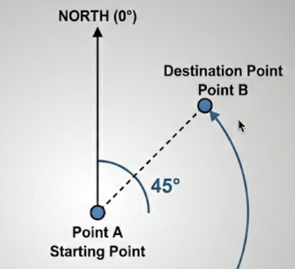
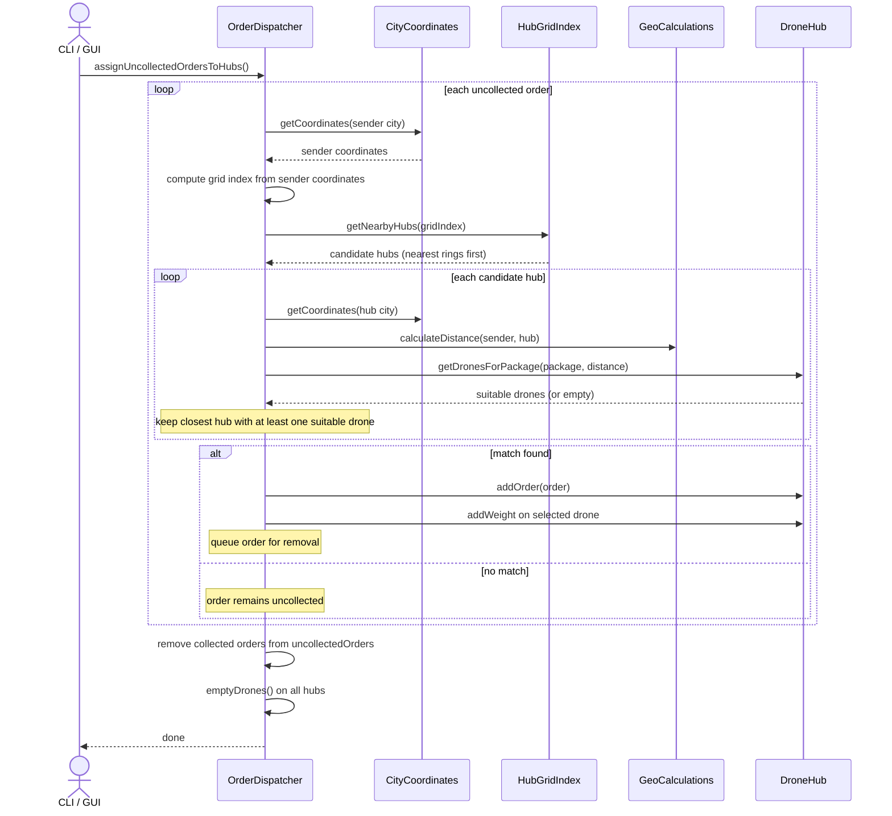
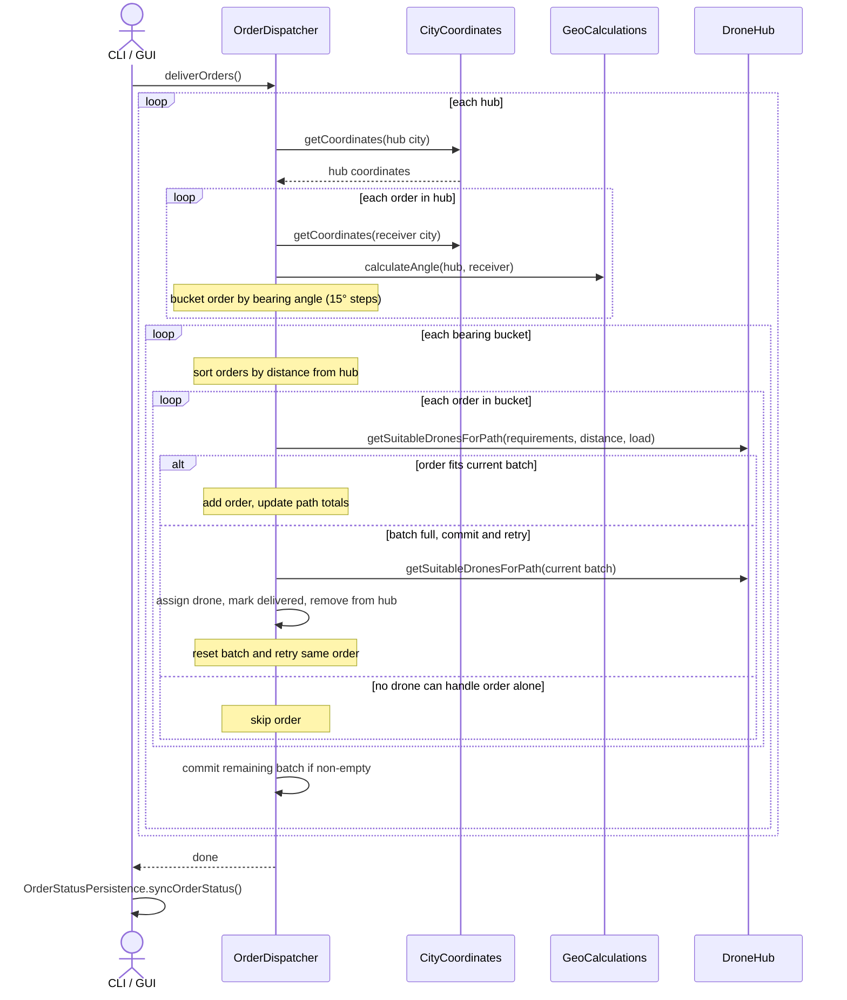
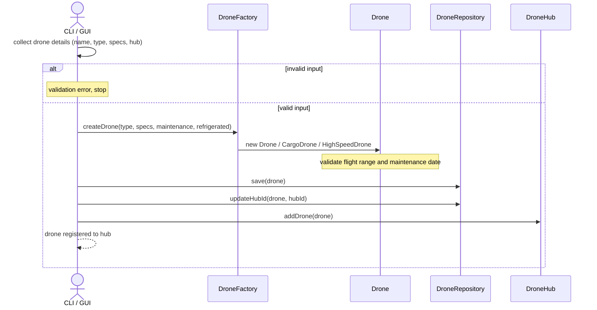

# Drone Delivery System

A Java application that simulates the management and operation of a drone-based parcel delivery network. The system models a network of drone hubs, each equipped with a fleet of drones and a crew of maintenance personnel. Customers can submit delivery orders with specific package requirements, and the system assigns those orders to the nearest suitable hub and drone, then delivers them in optimized batches using geographic calculations.

The application is available in two modes that share the same backend:
- **CLI** - an interactive console menu for full system control
- **GUI** - a JavaFX desktop interface covering all the same operations

---

## System Operations

All 16 actions below are available in both the CLI and the GUI. Every action is recorded to `audit.csv` when executed.

| # | Operation | Description |
|---|---|---|
| 1 | Create Drone Hub | Register a new hub with a name and address |
| 2 | Create Drone and assign to a Hub | Add a drone (Standard, Cargo, or High Speed) to a hub's fleet |
| 3 | Move Drone from one Hub to another | Transfer a drone between hubs |
| 4 | List all Drones from one Hub | View the full fleet of a given hub |
| 5 | List all Orders inside a Hub | View all orders currently assigned to a hub |
| 6 | Perform Drone maintenance for one Hub | Service drones that are due for maintenance using available mechanics |
| 7 | Create Order | Submit a new delivery order with sender, receiver, and package details |
| 8 | Pick up uncollected Orders | Assign uncollected orders to the nearest hub with a suitable drone |
| 9 | Deliver Orders | Dispatch picked-up orders from each hub in optimized delivery batches |
| 10 | Add Personnel to a Hub | Register a crew member (Mechanic, Operator, Commander) to a hub |
| 11 | List Hub Crew and availability | View all personnel assigned to a hub and their current status |
| 12 | List available Drones from one Hub | View only the drones currently available for assignment |
| 13 | Show uncollected Orders | List all orders waiting to be picked up |
| 14 | Show delivered Orders | List all orders that have been successfully delivered |
| 15 | Check Hub maintenance status | Identify drones overdue for maintenance without performing it |
| 16 | Show nearby Hubs for a City | Find all hubs sorted by distance from a given city |

---

## Domain Model

### `Drone`
The base entity for all drones. Holds a name, flight range (0–550 km), maximum payload, maximum speed, availability status, last maintenance date, and current load. Validates flight range and maintenance date on construction. Implements `DroneCapabilities`.

- `canReach(distance)` - checks whether a drone can cover the required distance
- `canCarry(pkg / load)` - checks whether remaining payload capacity is sufficient
- `addWeight(weight)` / `emptyLoad()` - manage load accumulation during dispatch

### `CargoDrone extends Drone`
A drone variant designed for heavy or sensitive freight. Adds a `hasRefrigerator` flag. Handles **refrigerated** packages only when `hasRefrigerator` is true, and always handles **hazardous** packages. Cannot handle fragile packages.

### `HighSpeedDrone extends Drone`
A drone variant optimized for time-sensitive deliveries. Capable of handling **express delivery** packages. Cannot handle fragile or hazardous packages.

### `DroneCapabilities` _(interface)_
Defines capability checks: `canHandleRefrigeratedPackage()`, `canHandleExpressDelivery()`, `canHandleFragilePackage()`, `canHandleHazardousPackage()`. Provides default methods `requirementSatisfied(PackageRequirement)` and `satisfiesPackageRequirements(Package)` that evaluate a package's full requirement set against a drone's capabilities.

### `DroneHub`
The central operational unit. Aggregates a fleet of drones, a list of assigned orders, and a crew of personnel. Maintains a separate list of drones currently under maintenance.

Key methods:
- `getDronesForPackage(pkg, distance)` - returns all available drones tied at the lowest remaining payload capacity that can still carry the package and reach the destination, using a sorted `TreeMap`
- `getSuitableDronesForPath(requirements, distance, load)` - returns drones suitable for a multi-stop delivery path given cumulative requirements, distance, and load
- `checkFleetMaintenance()` - removes drones from the active fleet if they have not been serviced in 18+ months, placing them in a maintenance queue
- `performMaintenance()` - assigns available mechanics to queued drones one-to-one, restoring their availability

### `Order`
Represents a delivery request. Links a sender `Contact`, a receiver `Contact`, and a `Package`.

### `OrderBuilder`
Builds an `Order` step by step: sender address → sender contact → receiver address → receiver contact → package. Throws `IllegalStateException` if `build()` is called before required fields are set. Used by both the CLI wizard and the multi-step GUI form.

### `Package`
Holds physical dimensions (weight, width, length, height) and a `Set<PackageRequirement>`. Validates that all dimensions are positive on construction.

### `PackageRequirement` _(enum)_
`NONE`, `REFRIGERATED`, `EXPRESS_DELIVERY`, `FRAGILE`, `HAZARDOUS`. Used to constrain which drone types can handle a given package.

### `Contact`
Represents either a sender or receiver. Holds name, address, email, phone, and optional VAT number (for companies). Validates email format, international phone format (`+` followed by 7–15 digits), and VAT presence for company contacts.

### `Address`
An immutable value object holding country, city, street, and street number.

### `Personnel`
A crew member with a name, certification level, and availability state. Supports `assignToWork()` and `releaseFromWork()` with state guards - attempting to assign an already-busy member or release an already-free one throws a custom exception.

### `PersonnelCertification` _(enum)_
`NONE`, `MECHANIC`, `OPERATOR`, `COMMANDER`. Mechanics are the only role involved in drone maintenance.

### `DroneType` _(enum)_
`NORMAL`, `CARGO`, `HIGH_SPEED`. Used by `DroneFactory` to instantiate the correct drone subclass.

---

## Service Classes

### `OrderDispatcher`
_Singleton. The central orchestrator of the system._

Maintains:
- `Set<DroneHub> hubs` - all registered hubs
- `Set<Order> uncollectedOrders` - orders awaiting pickup
- `Map<Order, Drone> assignedDroneToOrder` - tracks which drone handled each delivery
- `Set<Order> deliveredOrders` - completed deliveries

**`assignUncollectedOrdersToHubs()`** is responsible for the following logic:
- iterate through the list of uncollected orders
- obtain the coordinates for the sender's city
- get the corresponding grid index for the sender's city
- get a list of nearby hubs for the sender's city
- for each hub:
  - compute the distance to the sender
  - get a list of all suitable drones (all drones that fully satisfy the requirements of that package)
  - in case the current hub is the closest to the sender (while also having at least one drone that can fully satisfy the requirements), the current hub becomes the best option for now
- after iterating through all hubs for an order, the package is assigned to the most suitable one
- basically, each package is assigned to the nearest hub that also has at least one drone which can fully satisfy the requirements

See the [order pickup sequence diagram](#order-pickup---assignuncollectedorderstohubs) in Workflow Visualization.

**`deliverOrders()`** is responsible for the following logic:
- iterate through all hubs
- get the hub's coordinates
- iterate through all orders inside a hub:
  - get the coordinates of the destination city
  - compute the bearing angle from the hub to the destination (the trajectory the drone has to follow in order to deliver that package, 2 completely different angles meaning 2 unrelated directions - the greater the difference, the sharper the turn needs to be)
  - since we want to deliver orders that are pretty much in a 'straight line', we group them by their bearing angle - orders with similar bearing angles are put together in order to minimize the number of turns needed in the delivery process
  - normalize the obtained bearing angle values (have them grouped in buckets of 15º)
- after getting the normalized bearing angle values, we iterate through them:
   - get the corresponding list of Orders tied to that bearing angle
   - sort the orders by distance (get the nearest order to the hub first)
   - iterate through the sorted Orders list and:
      - gradually add the package's weight, requirements and total distance to be covered
      - check if there are any drones that can still satisfy the requirements
      - call the `getSuitableDronesForPath()` method in order to get a list of all drones that can meet the requirements, reach a certain distance, and carry a certain load
      - if the suitableDrones list isn't empty, that means we can add a new package to the batch
      - if the suitableDrones list is empty, that means one of two things:
        - the batch is empty and no suitable drones were found - the order is skipped and remains in the hub for a future delivery run
        - the batch already has orders assigned to it and is committed as-is, while the current order is the start of a new empty batch
   - in case the batch isn't empty and there is at least one suitable drone, we match it to the batch 

See the [order delivery sequence diagram](#order-delivery---deliverorders) in Workflow Visualization.

---

### `GeoCalculations`
_Stateless utility class. All methods are static or package-private._

**`calculateDistance(lat1, lon1, lat2, lon2)`**
- gets the coordinates of 2 points and computes the distance between them (the returned distance is a double and is measured in km)

**`calculateAngle(lat1, lon1, lat2, lon2)`**
- gets the coordinates of 2 points and computes the angle between them (for example, if the destination city is situated East, that means the angle between the starting point and destination is 90º)

---

### `HubGridIndex`
_Spatial index for fast nearby-hub lookup._

The world is divided into a grid of cells, each 0.3° × 0.3° (approximately 33 km per side at the equator). Each hub is mapped to a cell via `(gx << 32) | gy` - a single `long` key encoding both grid coordinates into a `HashMap<Long, List<DroneHub>>`.

**`getNearbyHubs(gridIndex)`** is responsible for the following logic:
- gets a gridIndex key to look for
- compute the coordinates starting from the given key (X-axis gets the 4 most significant bytes, while Y-axis gets the 4 least significant bytes)
- move in a circular motion (rings)
- for each cell on the current ring's perimeter, look it up in the `GRID` map
- collect the hubs found inside that cell
- return the hubs (hubs in closer rings appear earlier in the list)

---

### `CityCoordinates`
Reads latitude and longitude from a large JSON file (`cities.json` - gotten from https://github.com/lutangar/cities.json and adapted it to my use case) using a streaming `JsonParser` to avoid loading the entire file into memory. Lookups are case-insensitive. On the first lookup of a city the result is stored in a `HashMap<String, List<Double>>` cache; subsequent lookups return immediately without re-reading the file.

---

### `OrderStatusPersistence`
Synchronises the in-memory dispatcher state to the database after order creation, pickup, and delivery. Iterates `uncollectedOrders`, hub order lists, and `deliveredOrders`, calling the appropriate `OrderRepository` update methods to reflect the current `UNCOLLECTED`, `IN_HUB`, or `DELIVERED` status.

---

### `SampleDataManager`
Loads all hubs, drones, personnel, and uncollected orders from the database into the `OrderDispatcher` singleton on application startup, bridging the persistent state with the runtime dispatch model.

---

### `AuditService`
Appends a `name_of_action, timestamp` line to `audit.csv` every time a user-facing action is executed. Called from both the CLI menu and all GUI controllers. Actions are typed through `AuditActions` - an enum that maps each constant to its canonical CSV key string, preventing typos and enabling refactoring safety.

---

## Workflow Visualization

Sequence diagrams for order pickup, order delivery, and drone registration workflows. Each diagram shows how the CLI/GUI action flows through the service layer.

### Order pickup - assignUncollectedOrdersToHubs()

Assigns each uncollected order to the nearest hub that has a drone capable of handling the package.

### Order delivery - deliverOrders()

Dispatches hub orders in directional batches, assigning each batch to a drone that can cover the cumulative path.

### Create drone and assign to hub

Creates a drone through the factory, persists it, and registers it to a hub in both memory and the database.

---

## Custom Exceptions

All 9 custom exceptions extend `RuntimeException` and are thrown at the domain/validation boundary: `InvalidFlightRangeException`, `InvalidMaintenanceDateException`, `InvalidEmailAddressException`, `InvalidPhoneNumberException`, `InvalidVatNumberException`, `InvalidDimensionException`, `AlreadyAssignedException`, `AlreadyFreeException`, and `CoordinatesNotFoundException`.

---

## Persistence - Repository Classes

All repositories are **singletons** and implement `BaseRepository<T>`, a generic interface that declares `findById`, `findAll`, `save`, `update`, `delete`, and `deleteById`. Persistence is backed by **PostgreSQL** via plain JDBC. The connection is managed by `DbConnectionManager` (also a singleton), which reads credentials from `db.properties` on the classpath.

The database schema is defined in `src/main/resources/db/schema.sql` and the ERD is available as `src/main/resources/db/schema.png`.

| Repository | Entity | Notable extras |
|---|---|---|
| `AddressRepository` | `Address` | - |
| `ContactRepository` | `Contact` | Saves nested `Address` in the same transaction |
| `DroneHubRepository` | `DroneHub` | Saves nested `Address` in the same transaction |
| `DroneRepository` | `Drone` | `findByHubId`, `updateHubId` for hub transfer |
| `PersonnelRepository` | `Personnel` | `findByHubId`, `updateHubId` for hub assignment |
| `PackageRepository` | `Package` | Manages `package_requirements` join table |
| `OrderRepository` | `Order` | `updateOrderStatus`, `updateHubId`, `markAsDelivered`, `getUncollectedOrders`, `getDeliveredOrders`, `findByHubId` |

---

## Unit Tests

Tests are written with **JUnit 5** and cover the two core geo-services: `GeoCalculationsTest` (6 tests) verifies zero-distance cases, known-city distance accuracy, distance symmetry, zero-angle cases, positive bearing angles, and opposite bearings on reversed routes; `CityCoordinatesTest` (7 tests) verifies coordinate lookups, case-insensitive search, cache hit performance, and graceful handling of unknown or blank city names.
